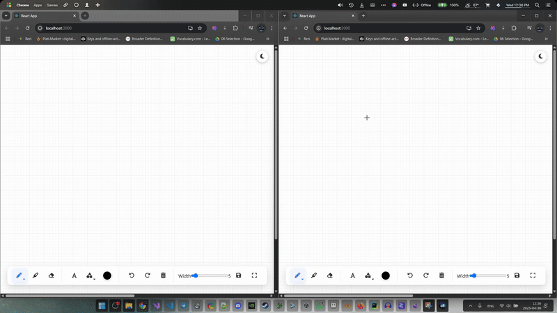

#  Real-Time Collaborative Whiteboard


A web-based collaborative whiteboard application allowing multiple users to draw simultaneously in real-time. Built with Django Channels and React.



##  Features

*   **Real-Time Collaboration:** See other users' drawings appear instantly.
*   **Basic Drawing Tools:** Pen and Eraser functionality.
*   **Tool Selection:** Easily switch between available tools.
*   **WebSocket Communication:** Efficient real-time updates using Django Channels.
*   **Interactive Canvas:** Smooth drawing experience powered by React and Konva.js.

*(Planned Features: Color Picker, Brush Size, Shapes, Text Tool, Undo/Redo, etc.)*

##  Tech Stack

**Backend:**
*   Python
*   Django
*   Django Channels (WebSockets)
*   ASGI Server (Daphne/Uvicorn)

**Frontend:**
*   React.js
*   Konva.js (HTML5 Canvas Framework)
*   JavaScript (ES6+)
*   CSS3

**Database:**
*   SQLite (Default for Development)

##  Setup & Installation

Follow these steps to get the project running locally:

**Prerequisites:**
*   Python 3.8+ and Pip
*   Node.js and npm (or Yarn)
*   Git

**Backend Setup:**

1.  **Clone the repository:**
    ```bash
    git clone https://github.com/wldoooon/realtime_whiteboard
    cd whiteBoard-Project
    ```
2.  **Create and activate a virtual environment:**
    ```bash
    python -m venv venv
    .\venv\Scripts\activate
    ```
    *(On Git Bash/Linux/macOS: `source venv/bin/activate`)*

4.  **Apply Django migrations:**
    ```bash
    python manage.py migrate
    ```
5.  **Run the Django development server (with ASGI):**
    ```bash
    daphne whiteBoardProject.asgi:application
    ```
    The backend should now be running, typically on `http://127.0.0.1:8000`.

**Frontend Setup:**

1.  **Navigate to the frontend directory:**
    ```bash
    cd frontend-whiteboard
    ```
2.  **Install Node.js dependencies:**
    ```bash
    npm install
    ```
    *(Or `yarn install` if using Yarn)*
3.  **Start the React development server:**
    ```bash
    npm start
    ```
    *(Or `yarn start`)*
    The frontend should now be running, typically on `http://localhost:3000`.

##  usage

1.  Ensure both the backend (Daphne/Uvicorn) and frontend (React dev server) are running.
2.  Open your web browser and navigate to `http://localhost:3000`.
3.  Open the same URL in another browser tab or window to simulate multiple users.
4.  Select a tool from the left toolbar (Pen or Eraser).
5.  Click and drag on the white canvas area to draw.
6.  Changes should appear in real-time across all open instances.

## 🤝 Contributing

Contributions are welcome! If you'd like to contribute, please fork the repository and create a pull request. You can also open an issue for bugs or feature suggestions.


